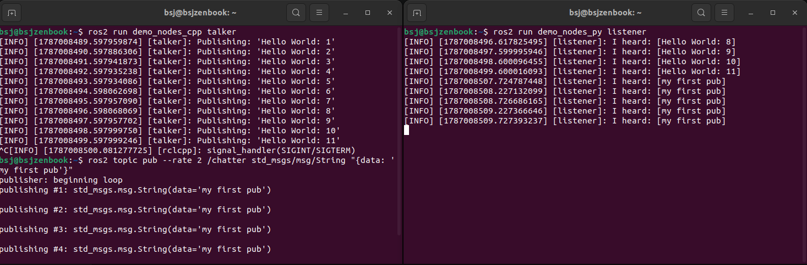

# 실습 미션 1: talker와 listener 해부하기

## talker(메시지 발행용 노드) 실행
```
# 내장 발행자 노드
ros2 run demo_nodes_cpp talker
```

## listener(메시지 구독용 노드) 실행
```
ros2 run demo_nodes_py listener
```

---

# 실습 미션 2: 터미널이 노드가 되다 — topic pub으로 개입하기
```
# 직접 메시지 설정해 발행자 생성
ros2 topic pub --rate 2 /chatter std_msgs/msg/String "{data: 'my first pub'}"
```


## 결과
